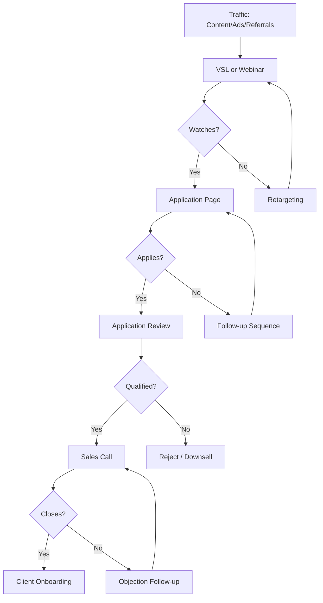

# Application Funnel

**Best for:** High-ticket coaching, masterminds, services over $2k

## Stages

| Stage | Purpose | Content | Key Metric |
|-------|---------|---------|------------|
| Traffic | Attract serious buyers | Content, ads, referrals | Visitors |
| VSL/Webinar | Build desire | Long-form video content | Watch time |
| Application | Filter serious buyers | Application form | Applications |
| Call | Close on call | Sales call | Close rate |
| Onboarding | Start engagement | Welcome, kickoff | Completion |

## Copy Elements

### VSL Page
```
How {{ICP}} {{Achieve Outcome}} — Free Training

Watch this {{X}}-minute video to learn:
- [Key insight 1]
- [Key insight 2]
- [Key insight 3]

[Play video CTA]
```

### Application Page
```
Apply to Join {{Program}}

This isn't for everyone. We work with {{specific ICP}} who are ready to {{commitment}}.

If that's you, apply below.

[Application form]
```

### Application Questions
```
1. What's your current situation?
2. What's your goal in the next 12 months?
3. What's been holding you back?
4. Why now?
5. Are you ready to invest $X to achieve this?
```

## Mermaid Diagram



## Key Metrics

| Stage | Target |
|-------|--------|
| Visitor → VSL Watch | 30-50% |
| VSL → Application | 5-15% |
| Application → Call | 50-70% |
| Call → Close | 20-40% |
