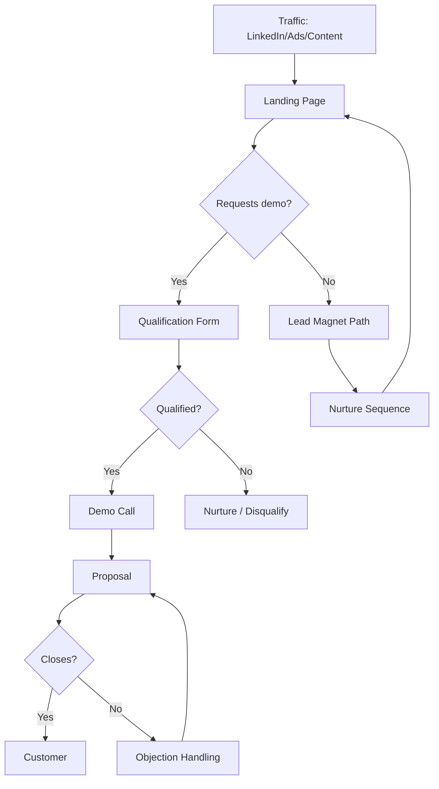

# Demo Request Funnel

**Best for:** SaaS products over $100/mo, sales-assisted

## Stages

| Stage | Purpose | Content | Key Metric |
|-------|---------|---------|------------|
| Traffic | Attract ICP | Ads, LinkedIn, Content | Visitors |
| Landing Page | Capture lead | Value prop, demo CTA | Demo requests |
| Qualification | Filter fit | Form fields or SDR call | Qualified leads |
| Demo | Show value | Personalized walkthrough | Demo completion |
| Proposal | Present offer | Pricing, ROI, timeline | Proposals sent |
| Close | Get signature | Negotiation, objection handling | Win rate |

## Copy Elements

### Landing Page
```
See how {{Company Type}} {{Achieve Outcome}}

[Value prop]
[Social proof]
[Demo CTA]
```

### CTA
```
Book a demo
See it in action
Get a walkthrough
```

### Confirmation Email
```
Subject: Your demo is booked

{{Name}},

Looking forward to showing you {{Product}} on {{date}}.

Before we meet:
- [Prep item 1]
- [Prep item 2]

See you soon.

{{Signature}}
```

## Mermaid Diagram



## Key Metrics

| Stage | Target |
|-------|--------|
| Visitor → Demo Request | 2-5% |
| Demo Request → Qualified | 50-70% |
| Qualified → Demo Held | 70-85% |
| Demo → Proposal | 60-80% |
| Proposal → Close | 20-35% |
