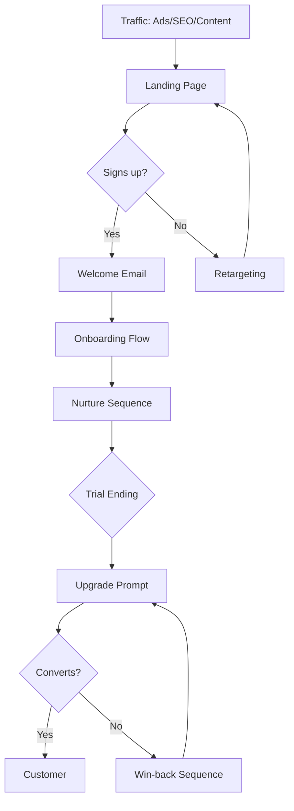

# Free Trial Funnel

**Best for:** SaaS products under $100/mo, self-serve signup

## Stages

| Stage | Purpose | Content | Key Metric |
|-------|---------|---------|------------|
| Traffic | Attract ICP | Ads, SEO, Content | Visitors |
| Landing Page | Convert to trial | Value prop, social proof, CTA | Trial signups |
| Onboarding | Activate users | Welcome email, setup wizard | Activation rate |
| Nurture | Drive usage | Tips emails, feature highlights | Engagement |
| Upgrade | Convert to paid | Upgrade prompts, limit reminders | Conversion rate |
| Retention | Reduce churn | Check-ins, success emails | Churn rate |

## Copy Elements

### Landing Page Headline
```
{{Outcome}} without {{Pain}}
```

### CTA
```
Start free trial
Try free for 14 days
Get started free
```

### Onboarding Email 1
```
Subject: Welcome to {{Product}} — here's your first step

{{Name}},

Welcome! You're in.

Here's the one thing to do right now: [Single action]

Takes 2 minutes and sets you up for success.

[CTA Button]

{{Signature}}
```

### Upgrade Email
```
Subject: You've hit your limit

{{Name}},

You've reached your [limit type] on the free plan.

To keep going, upgrade to Pro and unlock:
- [Benefit 1]
- [Benefit 2]
- [Benefit 3]

[Upgrade CTA]

{{Signature}}
```

## Mermaid Diagram



## Key Metrics

| Stage | Target |
|-------|--------|
| Visitor → Trial | 2-5% |
| Trial → Activated | 40-60% |
| Activated → Paid | 15-25% |
| Monthly Churn | <5% |
