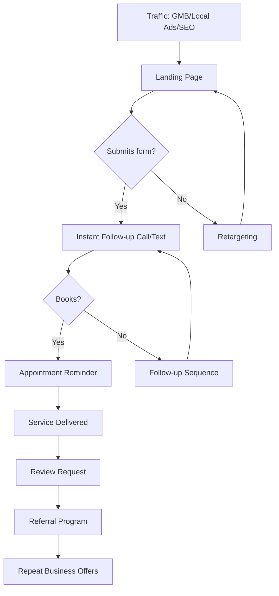

# Local Lead Funnel

**Best for:** Local services — plumbers, dentists, gyms, contractors, etc.

## Stages

| Stage | Purpose | Content | Key Metric |
|-------|---------|---------|------------|
| Traffic | Local visibility | GMB, local SEO, local ads | Visitors |
| Landing Page | Capture lead | Service page, contact form | Leads |
| Follow-up | Book appointment | Call, text, email | Appointments |
| Service | Deliver value | In-person service | Completion |
| Review | Build reputation | Review request | Review rate |
| Referral | Drive word-of-mouth | Referral program | Referrals |

## Copy Elements

### Landing Page
```
{{Service}} in {{Location}} — Free Quote

[Hero image]
[Trust badges]
[Contact form or click-to-call]
[Reviews]
[Service areas]
```

### CTA Options
```
Get free quote
Call now
Book online
Schedule service
```

### Follow-up Text
```
Thanks for reaching out! This is {{Name}} from {{Business}}.

When works best for a quick call to discuss your {{service}} needs?
```

### Review Request
```
Subject: How'd we do?

{{Name}},

Thanks for choosing {{Business}}!

If you were happy with our service, would you mind leaving a quick review?

[Review link]

It takes 30 seconds and helps us help more people like you.

Thanks!
{{Signature}}
```

## Mermaid Diagram



## Key Metrics

| Stage | Target |
|-------|--------|
| Visitor → Lead | 5-15% |
| Lead → Appointment | 40-60% |
| Appointment → Show | 80-90% |
| Service → Review | 20-40% |
| Customer → Referral | 10-20% |
