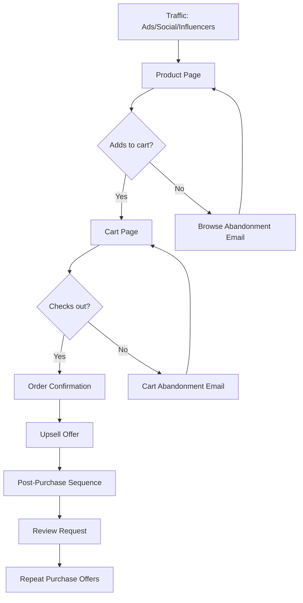

# Product Funnel (E-commerce)

**Best for:** E-commerce products under $100, impulse/considered

## Stages

| Stage | Purpose | Content | Key Metric |
|-------|---------|---------|------------|
| Traffic | Drive visitors | Ads, social, influencers | Visitors |
| Product Page | Convert to cart | Images, copy, reviews | Add to cart |
| Cart | Reduce abandonment | Trust signals, urgency | Cart completion |
| Checkout | Complete purchase | Simple form, payment | Conversion rate |
| Upsell | Increase AOV | Related products, bundles | Upsell rate |
| Post-Purchase | Drive repeat | Thank you, review ask, offers | Repeat rate |

## Copy Elements

### Product Page
```
{{Product}} — {{Key Benefit}}

[Hero image]
[Price]
[Add to cart CTA]
[Reviews]
[Benefits]
```

### Cart Abandonment Email
```
Subject: You left something behind

{{Name}},

You left {{product}} in your cart.

[Product image]
[Complete purchase CTA]

Questions? Reply to this email.

{{Signature}}
```

### Post-Purchase
```
Subject: Your order is on the way

{{Name}},

Thanks for your order! Here's what to expect:

[Order details]
[Shipping info]
[What's next]

{{Signature}}
```

## Mermaid Diagram



## Key Metrics

| Stage | Target |
|-------|--------|
| Visitor → Add to Cart | 5-10% |
| Add to Cart → Purchase | 30-50% |
| Cart Abandonment Recovery | 5-15% |
| Upsell Acceptance | 10-20% |
| Repeat Purchase (90 days) | 20-40% |
