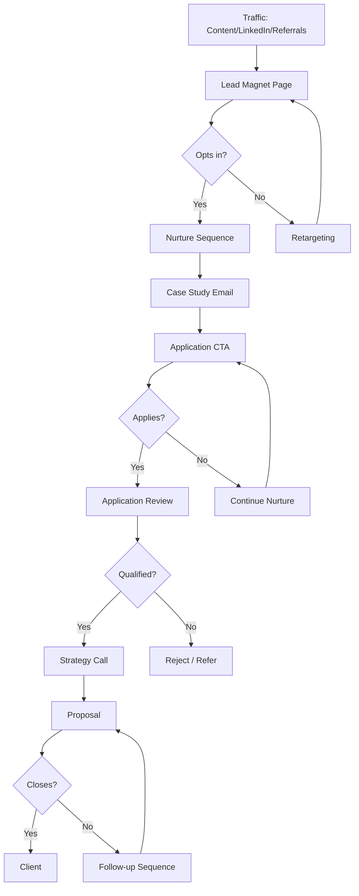

# Strategy Call Funnel

**Best for:** Agencies, consultants, B2B services over $2k

## Stages

| Stage | Purpose | Content | Key Metric |
|-------|---------|---------|------------|
| Traffic | Attract ICP | Content, referrals, LinkedIn | Visitors |
| Lead Magnet | Capture lead | Guide, audit, template | Opt-ins |
| Nurture | Build trust | Case studies, insights | Engagement |
| Application | Qualify interest | Application form | Applications |
| Strategy Call | Assess fit + pitch | Discovery + recommendation | Calls booked |
| Proposal | Present offer | Scope, price, timeline | Proposals sent |
| Close | Get commitment | Follow-up, negotiation | Win rate |

## Copy Elements

### Lead Magnet Landing Page
```
Free {{Resource}}: How to {{Outcome}}

[What they'll learn]
[Who it's for]
[What they'll get]

[Download CTA]
```

### Application Page
```
Apply to Work With Us

We help {{ICP}} achieve {{outcome}}.

Not everyone is a fit. Apply below and we'll reach out if there's alignment.

[Application Form]
```

### Call Booking
```
Book Your Free Strategy Call

In 30 minutes, we'll:
- Understand your current situation
- Identify your biggest opportunity
- Map out a path forward

No pitch unless you ask. If we're not a fit, we'll tell you.

[Book CTA]
```

## Mermaid Diagram



## Key Metrics

| Stage | Target |
|-------|--------|
| Visitor → Opt-in | 20-40% |
| Opt-in → Application | 5-15% |
| Application → Call | 50-70% |
| Call → Proposal | 60-80% |
| Proposal → Close | 30-50% |
