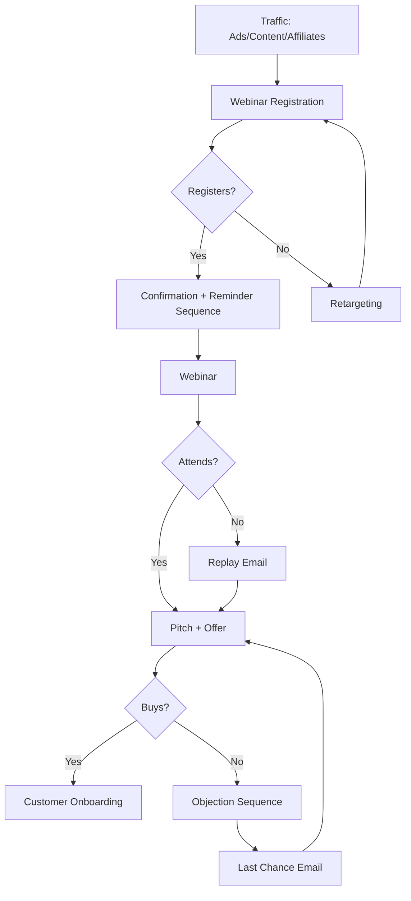

# Webinar Funnel

**Best for:** Courses, coaching, info products under $500

## Stages

| Stage | Purpose | Content | Key Metric |
|-------|---------|---------|------------|
| Traffic | Drive registrations | Ads, content, affiliates | Visitors |
| Registration | Capture lead | Webinar landing page | Registrations |
| Pre-Webinar | Increase show rate | Reminder emails | Show rate |
| Webinar | Educate + pitch | Value content + offer | Attendees |
| Offer | Convert attendees | Sales page, bonuses, urgency | Conversion |
| Follow-up | Convert non-buyers | Replay, objection emails | Late conversions |

## Copy Elements

### Registration Page
```
Free Training: How to {{Outcome}} in {{Timeframe}}

You'll learn:
- [Takeaway 1]
- [Takeaway 2]
- [Takeaway 3]

[Save my seat CTA]
```

### Reminder Emails
```
Subject: Starting in 24 hours
Subject: We're live in 1 hour
Subject: We're live now!
```

### Offer CTA
```
Join now
Enroll today
Get instant access
```

## Mermaid Diagram



## Key Metrics

| Stage | Target |
|-------|--------|
| Visitor → Registration | 20-40% |
| Registration → Show | 30-50% |
| Attendee → Purchase | 5-15% |
| Replay → Purchase | 2-5% |
